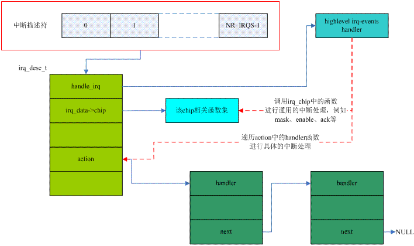

# 中断相关总结
中断子系统讲解：
https://blog.csdn.net/weixin_41028621/category_8797155.html

http://wiki.100ask.org/index.php?title=%E7%AC%AC%E4%BA%94%E8%AF%BE._%E4%B8%AD%E6%96%AD%E7%B3%BB%E7%BB%9F%E4%B8%AD%E7%9A%84%E8%AE%BE%E5%A4%87%E6%A0%91&variant=zh

https://www.cnblogs.com/arnoldlu/category/1117988.html

三大结构体：https://www.cnblogs.com/lifexy/p/7506504.html
yingjian:https://blog.csdn.net/xiaojsj111/article/details/14129661

## 一些关键词
异步中断：中断是异步产生的，不是由CPU执行程序产生的，中断属于异常的一种，中断是唯一与CPU运行无关的异常

硬件中断号：hwirq
虚拟中断号：virq
当中断发生时，首先获取触发中断的HW ID，然后通过irq domin译码成IRQ number


中断的一个大体执行流程：
1、中断入口与现场保护
2、中断服务程序
3、中断返回与现场恢复

IRQ number:CPU需要为每一个外设中断编号，称之IRQ Number，这个IRQ number是一个虚拟的interrupt ID，和硬件无关，仅仅是被CPU用来标识一个外设中断.

中断描述符：
在Linux kernerl中，对于每一个外设的IRQ都用struct irq_desc来描述，称之为中断描述符(struct irq_desc)
中断控制器可以向CPU发出多种中断，每一种中断的处理方式不同，就通过irq_desc[NR_IRQS]来对应中断的：


通用中断处理流程：

```c
/**
 * struct irq_desc - interrupt descriptor
 * @irq_common_data:	per irq and chip data passed down to chip functions
 * @kstat_irqs:		irq stats per cpu
 * @handle_irq:		highlevel irq-events handler
 * @preflow_handler:	handler called before the flow handler (currently used by sparc)
 * @action:		the irq action chain
 * @status:		status information
 * @core_internal_state__do_not_mess_with_it: core internal status information
 * @depth:		disable-depth, for nested irq_disable() calls
 * @wake_depth:		enable depth, for multiple irq_set_irq_wake() callers
 * @irq_count:		stats field to detect stalled irqs
 * @last_unhandled:	aging timer for unhandled count
 * @irqs_unhandled:	stats field for spurious unhandled interrupts
 * @threads_handled:	stats field for deferred spurious detection of threaded handlers
 * @threads_handled_last: comparator field for deferred spurious detection of theraded handlers
 * @lock:		locking for SMP
 * @affinity_hint:	hint to user space for preferred irq affinity
 * @affinity_notify:	context for notification of affinity changes
 * @pending_mask:	pending rebalanced interrupts
 * @threads_oneshot:	bitfield to handle shared oneshot threads
 * @threads_active:	number of irqaction threads currently running
 * @wait_for_threads:	wait queue for sync_irq to wait for threaded handlers
 * @nr_actions:		number of installed actions on this descriptor
 * @no_suspend_depth:	number of irqactions on a irq descriptor with
 *			IRQF_NO_SUSPEND set
 * @force_resume_depth:	number of irqactions on a irq descriptor with
 *			IRQF_FORCE_RESUME set
 * @rcu:		rcu head for delayed free
 * @kobj:		kobject used to represent this struct in sysfs
 * @request_mutex:	mutex to protect request/free before locking desc->lock
 * @dir:		/proc/irq/ procfs entry
 * @debugfs_file:	dentry for the debugfs file
 * @name:		flow handler name for /proc/interrupts output
 */
struct irq_desc {
	struct irq_common_data	irq_common_data;
	struct irq_data		irq_data;
	unsigned int __percpu	*kstat_irqs;
	irq_flow_handler_t	handle_irq;
#ifdef CONFIG_IRQ_PREFLOW_FASTEOI
	irq_preflow_handler_t	preflow_handler;
#endif
	struct irqaction	*action;	/* IRQ action list */
	unsigned int		status_use_accessors;
	unsigned int		core_internal_state__do_not_mess_with_it;
	unsigned int		depth;		/* nested irq disables */
	unsigned int		wake_depth;	/* nested wake enables */
	unsigned int		irq_count;	/* For detecting broken IRQs */
	unsigned long		last_unhandled;	/* Aging timer for unhandled count */
	unsigned int		irqs_unhandled;
	atomic_t		threads_handled;
	int			threads_handled_last;
	raw_spinlock_t		lock;
	struct cpumask		*percpu_enabled;
	const struct cpumask	*percpu_affinity;
#ifdef CONFIG_SMP
	const struct cpumask	*affinity_hint;
	struct irq_affinity_notify *affinity_notify;
#ifdef CONFIG_GENERIC_PENDING_IRQ
	cpumask_var_t		pending_mask;
#endif
#endif
	unsigned long		threads_oneshot;
	atomic_t		threads_active;
	wait_queue_head_t       wait_for_threads;
#ifdef CONFIG_PM_SLEEP
	unsigned int		nr_actions;
	unsigned int		no_suspend_depth;
	unsigned int		cond_suspend_depth;
	unsigned int		force_resume_depth;
#endif
#ifdef CONFIG_PROC_FS
	struct proc_dir_entry	*dir;
#endif
#ifdef CONFIG_GENERIC_IRQ_DEBUGFS
	struct dentry		*debugfs_file;
	const char		*dev_name;
#endif
#ifdef CONFIG_SPARSE_IRQ
	struct rcu_head		rcu;
	struct kobject		kobj;
#endif
	struct mutex		request_mutex;
	int			parent_irq;
	struct module		*owner;
	const char		*name;
} ____cacheline_internodealigned_in_smp;
```
系统中每一个连接外设的中断线(irq request line)用一个中断描述符来描述，每一个外设的interrupt request line分配一个中断号(irq number),系统中有多少个中断线(中断源)就有多少个中断描述符(struct irq_desc)。NR_IRQS定义了硬件平台IRQ的最大数目。中断描述符的组织方式一般有两种：
1、radix-tree方式，这是以基数树的方法来组织irq_desc;
2、数组的方式，在系统初始化的时候定义一个全局数组
全局数组的方式容易导致内存空间的浪费

https://blog.csdn.net/weixin_41028621/article/details/101753159

中断的函数执行流程：
https://www.cnblogs.com/arnoldlu/p/8659981.html

## request_irq
实现动态地申请注册一个中断，根据传入的irq号获得数组irq_desc中以irq未下标的元素，然后动态地创建一个irqaction的描述符，根据传入的参数初始化新生成的irqaction描述符，最后调用函数_setup_irq()把该描述符假如到IRQ链表中，完成中断的动态申请及注册。
```c
//中断注册API
//irq是中断编号、myhandler是中断处理函数、flages是中断类型，name是设备名称、dev指设备
request_irq(unsigned int irq, irq_handler_t handler, unsigned long flags,const char *name, void *dev)
{
	return request_threaded_irq(irq, handler, NULL, flags, name, dev);
}
```

 中断处理的流程：(https://blog.csdn.net/LuckyDog0623/article/details/120912442)
①发生中断时，cpu响应执行异常向量表__vectors_start  
②接着到--》vector_irq中断代码（在这里会计算返回值，保存一些寄存器，进入管理模式）
③vector_irq最后会调用中断处理总入口asm_do_IRQ
④asm_do_IRQ根据中断号调用irq_desc[??]数组项的处理函数handle_irq
⑤handle_irq接着会调用irq_desc[??]中chip成员设置硬件，比如清除中断，禁止中断，重新使能中断
⑥handle_irq会逐个调用action成员链表中注册的处理函数

x86 process:
https://blog.csdn.net/yin262/article/details/53994699


!!!!!!!!!!!net_irq:https://jishuin.proginn.com/p/763bfbd69efd
yi chang xiang liang biao :https://blog.csdn.net/qq_17270067/article/details/104974601
IDT:https://blog.csdn.net/qq_41208289/article/details/106012230?spm=1001.2101.3001.6650.1&utm_medium=distribute.pc_relevant.none-task-blog-2%7Edefault%7ECTRLIST%7Edefault-1-106012230-blog-47138979.pc_relevant_aa&depth_1-utm_source=distribute.pc_relevant.none-task-blog-2%7Edefault%7ECTRLIST%7Edefault-1-106012230-blog-47138979.pc_relevant_aa&utm_relevant_index=2

https://ty-chen.github.io/linux-kernel-interrupt/


from 0:https://blog.51cto.com/u_15169172/2710701


good process:http://t.zoukankan.com/lifexy-p-7506504.html
