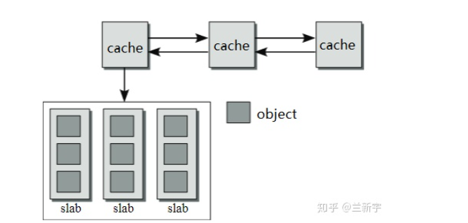

# cache 和 slab
## cache
在slab分配器中，每一类objects拥有一个"cache",cache:每分配一个object，都从包含若干个空闲的同类objects的区域中获取，释放时也直接回到这个区域，这样可以缓存和复用相同的objects，加快分配和释放的速度
## cache的内存
object从"cache"中获取内存，cache的内存从哪里来？
cache的内存从buddy分配器中来,slab直接面向程序的分配需求，相当于是前端，而buddy系统则成为slab分配器的后端


由于"cache"的内存是从buddy系统获得的，因此在物理上是连续的，如果是一个"cache"中的objects的数目较多，那么"cache的体积较大"，需要占用的物理内存较多，需要占用的连续物理内存较多，当object的数量增加或减少时，也不利于动态调整，因此一个"cache"分成了若干个slabs，同一"cache"中的slabs都存储相同的objects。

## cache结构体
```
struct kmem_cache {
    unsigned int gfporder;    /* order of pages per slab (2^n) */
    gfp_t allocflags;         /* force GFP flags */

    unsigned int num;         /* objects per slab */
    int object_size;
    unsigned int colour_off;  /* colour offset */
    size_t colour;            /* cache colouring range */

    struct list_head list;    /* cache creation & removal */
}
```
一个slab结构体由一个或多个page frame组成(通常为一个)，根据buddy系统的控制，在数量上必须是2的幂次方，"gfporder"实际定义了一个"cache"中每个slab的大小。
num:每个slab区域包含的object的个数
size:每个object的大小


# Slab的两个作用
1、slab对小对象进行分配，不用为每个小对象分配一个页，节省了空间

2、内核中一些小对象创建析构很频繁，Slab对这些小对象做缓存，可以重复利用一些相同的对象，减少内存分配次数
